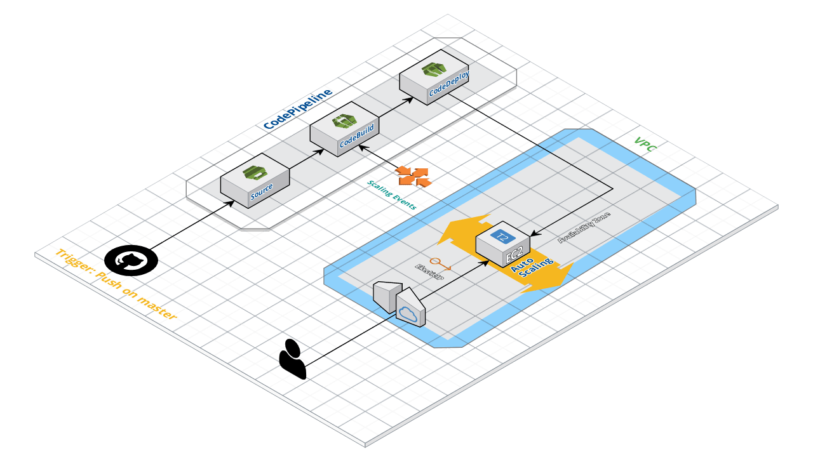

# Sales infrastructure

This infrastructure stack is used for the deployment of the Sales application. The Infrastructure language as code used is **terraform**.

The infrastructure consists of:

 - an **EC2** launched within an **AutoscalignGroup** com min and max capacity set to 1 to ensure resilience. 
 - An **ElasticIP** to maintain a static ip reachable from the outside. Each time an instance is launched, the machine assigns itself the ElasticIP.
 - A **CodePipeline** to ensure CI/CD. Composed by 3 stages (**Source**, **CodeBuild**, **CodeDeploy**). 
  Each time a push is made into Sales application code repository the pipeline is triggered. It clones the code, performs unit tests, builds the code, deploys and run the package into the EC2. The CodeDeploy component is automatically started even when the autoscalingGroup starts a new EC2.

# Overview

## Requirements

 - Terraform >= v0.12.23
 - AWS profile
 - Bucket S3 for Terraform backend 

## Deployment

 Deployment of EC2 stack:
 in root directory project:

    terraform init
    terraform apply --auto-approve

deployment of Codepipeline stack:
in codepiepeline directory:

    terraform init
    terraform apply --auto-approve